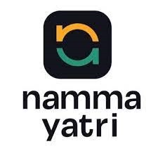

(./img2.jpg)
# Namma Yatri   
Problem Statement 2: Booking Without App

The ability to book a Namma Yatri auto could open  up more demand. Build innovative tech solutions to  let customers book an auto without installing the  app - E.g. website, WhatsApp, SMS, Phone etc. This  will cater to users who are uncomfortable or  unwilling to use Apps. 

This can acheived by using WhatsApp’s official  Business API (Cloud API) from Meta.  
Using this API  we can easily send and receive any kinds of  message from the user enabling the customer to  book ride with their comfort.

### Feature for Riders
- Step 1: The Customer Initiates  the Conversation
- Step 2: Requesting  for current Location
- Step 3: Requesting for to  Location
- Step 4: Complete the ride

### Feature for Drivers
- Step 1: Dashboard
- Step 2: Register Driver
- Step 3: Login Driver
- Step 4: Available Rides 
- Step 5: Pick Ride
- Step 6: End Ride
